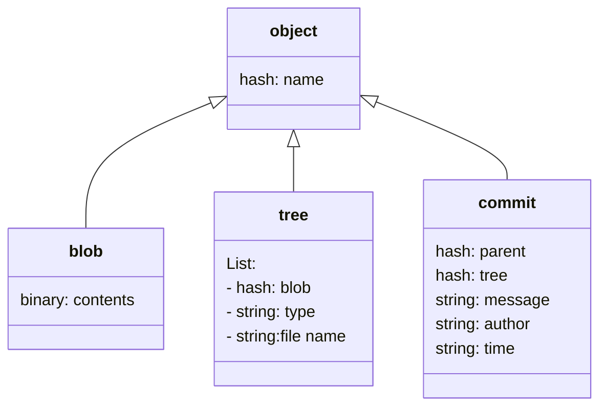

# What *is* git? 

## Admin

- I will be using [captioning](https://zipcaptions.app/#/) in classes going forward.  This is not a persistent transcript, but instead an ephemeral, live, AI generated caption of all of what I say.  At the start of each class, I will send the link to the page with the connection information for you to join the broadcast. 
- To get credit for the course toward your major, use the [provided template for the currciulum modification form](../img/cm_392_template.pdf).  Complete the form with your personal information and send it to [Professor DiPippo](mailto:ldipippo@uri.edu) to sign. 
- Reminder: [how to makeup experience badges](https://introcompsys.github.io/fall2023/syllabus/grading.html#makeup)
- Notice: [minor revision to that process](https://github.com/introcompsys/fall2023/commit/ecc4f51c2d0f1c61eeb804afc84fc282cce6c1f5)


```{note}
Notice, since the course website is a Jupyter book, if you look in the raw markdown for this page, the link to the form is the relative path.  One of the advantages of using a static site generator of any kind is that you can create references like variables to refer to other parts of the document and the static site generator can 
```
 
## Today's goals


last week we learned about what a commit is and then we took a break from how git works, to talk more about how developers communicate


Today, we are going to learn *what* git is, next we will learn about *why* git and bash are designed the way they are designed and next week we will learn *how* git creates a commit


```{admonition} Study Tip
We will go in an out of topics at times, in order to provides what is called *spaced repetition* repeating material or key concepts with breaks.  

Using git correctly is a really important goal of this course because git is an opportunity for you to demonstrate a wide range of both practical and conceptual understanding. 

So, i have elected to interleave other topics with git to give core git ideas some time to simmer and give you time to practice them before we build on them with more depth at git.  


Also, we are both learning git and *using* git as a motivating example of other key important topics.
```


## Why are we defining git in week 5 of using it? 

[git book](https://git-scm.com/book/en/v2) is the official reference on git.

```{note}
this includes other spoken languages as well if that is helpful for you.
```

From here, we have the full definition of git by the git developers:

```{epigraph}
git is fundamentally a content-addressable filesystem with a VCS user interface written on top of it.

--[git scm book]](https://git-scm.com/book/en/v2/Git-Internals-Plumbing-and-Porcelain)
```


We do not start from that point, because these documents were written for target audience of working developers who are familar with other version control systems and learning an *additional* one. 

Today, however, other version control systems are barely in use and this course is for computer science *students* and part of the goal is to learn what a Version Control System is. 


## Git is a File system

Let's break down the definition 


Content-addressable filesystem means a key-value data store. What this means is that you can insert any kind of content into a Git repository, for which Git will hand you back a unique key you can use later to retrieve that content.

Other examples of key-value pairs you may have seen before include: 
- python dictionaries
- pointers (address,content)
- parameter, passed values
- yaml files (from jupyter-book last week)


Again, we see that studying the developer tools is a good way to reinforce other concepts in computer science.  Modularity and Abstraction are the core foundations of the field, and while they do have their limits of applicability, it means that if you get a really good understanding of the core abstractions, that makes learning other things in CS faster.  

You can apply your past experience with these other concepts to help understand what to expect about how git works. 

## Git is a Version Control System


In the before times


git stores **snapshots** of your work each time you commit.


it uses 3 stages:


## Git has two sets of commands


Porcelain: the user friendly VCS

+++

Plumbing: the internal workings- a toolkit for a VCS

+++


We have so far used git as a version control system.  A version control system, in general, will have operations like commit, push, pull, clone.  These may work differently under the hood or be called different things, but those are what something needs to have in order to keep track of different versions.

+++

The plumbing commands reveal the *way* that git performs version control operations.  This means, they implement file system operations for the git version control system.  

+++

You can think of the plumbing vs porcelain commands like public/private methods.  As a user, you only need the public methods (porcelain commands) but those use the private ones to get things done (plumbing commands).  We will use the plumbing commands over the next few classes to examine what git *really* does when we call the porcelain commands that we will typically use.  

+++

## Git is distributed

+++

What does that mean?  

+++

Git runs locally.  It can run in many places, and has commands to help sync across remotes, but git does not require one copy of the repository to be the "official" copy and the others to be subordinate.  git just sees repositories.

+++

For human reasons, we like to have one "official" copy and treat the others as local copies, but that is a social choice, not a technological requirement of git. Even though we will typically use it with an offical copy and other copies, having a tool tht does not care, makes the tool more flexible and allows us to create workflows, or networks of copies that have any relationship we want.

+++


It's about the workflows, or the ways we socially *use* the tool.

+++


Some example workflows include:

+++


````{margin}
```{note}
In class I talked through each of these workflows from the diagrams. If making up class or looking back later, I recommend reading the [book section on workflows](https://git-scm.com/book/en/v2/Distributed-Git-Distributed-Workflows)
```
````
### Subversion  WOrkflow


+++

### Integration Manager


+++

### dictator and lieutenants


+++


## *How* does git do all these things?

Let's look at git again in our `github-inclass` repo.

I was still in my `tiny-book` repo so I went up one level, then used `ls` to remember the exact name of the `github-inclass` repo

```
cd ../
ls
```

```
github-inclass-fa23-brownsarahm	tiny-book
```


```
cd github-inclass-fa23-brownsarahm/
```


```
pwd
```

```
/Users/brownsarahm/Documents/inclass/systems/github-inclass-fa23-brownsarahm
```

We can use the bash command `find` to search the file *system* note that this does not search the contents of the files, just the names.

```
find .git/objects/ -type f
```

and we get this output: 
````{margin}
```{warning}
Your output will be different than mine. These are hashes of the content,  we all have different content (name and fun facts in the files) and the commit information, where we all have different email addresses and made commits at different seconds
```
````

```
.git/objects//04/2a42eb47c33ee43d793feb4d891a93e7460527
.git/objects//04/ab89e167ed77bc2a95710f69f68d91a6219471
.git/objects//69/3a2b5b9ad4c27eb3b50571b3c93dde353320a1
.git/objects//93/4c15dc2655c988c981d9a836783afebda77355
.git/objects//5a/a1ed29b82e1cebb8527019b0e594ba71dda214
.git/objects//5f/e5a9821625fad2cca4c500e497e6694132c303
.git/objects//d7/6bc523443bda5a5daae2fe7fcfbf6fba71ae6d
.git/objects//b3/78bd148e53dfa7195c58123362e40ae12ef3e7
.git/objects//bc/281792d6ab62b153d7bf44f7985ec7cfc3b850
.git/objects//ca/eacb503cf4776f075b848f0faff535671f2887
.git/objects//ca/feca302e31c65139b4a5294356e1ea8595dcb1
.git/objects//pack/pack-8631fedd908bc07c0b64786e9a83f5bf7a4de110.rev
.git/objects//pack/pack-8631fedd908bc07c0b64786e9a83f5bf7a4de110.pack
.git/objects//pack/pack-8631fedd908bc07c0b64786e9a83f5bf7a4de110.idx
.git/objects//11/d53c24bb5d2bf2e3f645ef188f8bc75fa9c911
.git/objects//45/fcb1dd311e5e45af759cb3627dca5f47f58f04
.git/objects//75/6c4879c0447db20980f73a26bc2ba072e08a6d
.git/objects//44/3f164cdde5059d78df6a61ca3f07bc6a605eb0
.git/objects//43/a1267370f1af98071d53f8508abbc56fa3abde
.git/objects//88/5588412d138cceb89f06ffed5e83c316c2b593
.git/objects//5c/8aaa9f2a129d551b8cb2cb294676f63c4af410
.git/objects//65/e9e39935be8400ef12cc9003592f12244b50da
.git/objects//3a/cf0fb1c2febd24561294bfb966e1ad1f033eb8
.git/objects//98/96f7a7000a7b9d2fdb12047a141524358286c3
.git/objects//37/0e04baf4f62d1e62f4949208bc5e4d33af5336
.git/objects//6d/4dbd33860fceb9c87bd3c4509deff8cecb3f45
.git/objects//39/f1c5eabb1458fa6cf9042611599b69665cf288
.git/objects//55/56d17391aeeec9b2b86d2821c011d7ed5377aa
.git/objects//b8/6eb90ba1ae5504edfcdc9ef8879e1c6d7a1b75
.git/objects//b6/2d570421c3096d8c80c7df56357cdd3203fd3a
.git/objects//ea/c84c8320a3ab4f37a441a332b828c45ecedcc9
.git/objects//e1/82616690a91a8d0e363f4143e68dd9e136ccee
.git/objects//e6/9de29bb2d1d6434b8b29ae775ad8c2e48c5391
.git/objects//8c/7cefb877c62a46a3b71c68a858c24075b379fe
.git/objects//76/8dec80c5e0734476d476ae83376c9c786b6450
.git/objects//2b/cb5d446129df427a1ce09e8ba658a5bb8ceca3
```

This is a lot of files! It's more than we have in our working directory. 


```
ls
```

```
API.md			about.md		helper_functions.py
CONTRIBUTING.md		abstract_base_class.py	important_classes.py
LICENSE.md		alternative_classes.py	setup.py
README.md		docs			tests
```

This is a consequence of git taking snap shots and tracking both the actual contents of our working directory **and** our commit messages and other meta data about each commit. The content of the `.git/objects` is *everything* git knows about our project. 


## Git HEADs

If we look at the content of the `.git` directory there is always a file called `HEAD`
```
ls .git/
```

```
COMMIT_EDITMSG	ORIG_HEAD	description	info		packed-refs
FETCH_HEAD	REBASE_HEAD	hooks		logs		refs
HEAD		config		index		objects
```


the program `git` does not run continously the entire time you are using it for a project.  It runs quick commands each time you tell it to, it's goal is to manage files, so this makes sense.  This also means that important information that `git` needs is also saved in files. 

the files in all caps are like gits variables. Lets look at the one called `HEAD` we have intereacted with `HEAD` before when resolving merge conflicts. 


```
cat .git/HEAD 
```

```
ref: refs/heads/main
```

`HEAD` is a pointer to the currently checked out branch. 


the other `*HEAD` files are other "heads" or "tips" of the tree of commits.  For example, I have one lingering from the last time I used `rebase` in my repo.  
```{note}
You may or may not have the same heads that I do, because you may have missed a step or I may have done an extra thing in my repo to demo something to answer a question in office hours
```

```
cat .git/REBASE_HEAD 
```

```
b378bd148e53dfa7195c58123362e40ae12ef3e7
```
This poitns to a specific commit, not a branch, because rebase occurs at a pair of specific commits, and does not move forward, this is sort of like a temporary variable, that does not get destroyed. 


We should all have `ORIG_HEAD` which is `origin/head` 
```
cat .git/ORIG_HEAD 
```

```
5c8aaa9f2a129d551b8cb2cb294676f63c4af410
```
 that points to a specific commit, instead of a branch.


We can see that git status matches what branch the `HEAD` file shows. 

```
git status
```

```
On branch main
Your branch is up to date with 'origin/main'.

nothing to commit, working tree clean
```

that matches the `HEAD` as expected.  Lets switch and look agian. 


first, get the options,

```
git branch
```

```
  1-create-an-about-file
  fun_fact
* main
```

 then `checkout` one of the exising branches
```
git checkout fun_fact
```

```
Switched to branch 'fun_fact'
Your branch is up to date with 'origin/fun_fact'.
```

and we can confirm that one of the things `checkout` does is updates the head file: 

```
cat .git/HEAD 
```

```
ref: refs/heads/fun_fact
```

## Branches are pointers to commits


Branches are implemented as files in `.git/refs/heads/` that contain the hash of the most recent commit "on" that branch. It's useful to think of branches having multiple commits, and a tree like structure:

```
gitGraph
	commit
	commit
	branch fun_fact
	checkout fun_fact
	commit
	commit
	checkout main
	commit 
	merge fun_fact
	commit
```

but literally, they are a pointer to a single commit.  (remember each commit has a pointer to its "parent" or preceiding commit)

We can see what commit a branch points to: 

```
cat .git/refs/heads/fun_fact 
```

```
756c4879c0447db20980f73a26bc2ba072e08a6d
```

`git branch` reads from the `.git/refs/heads` directory.  It has some other options that make it more powerful, but its default behavior is very similar to 
```
ls .git/refs/heads
```

```
1-create-an-about-file	fun_fact		main
```

```{warning}
This was an answer to a question, but I do not remember the question
```

```
cat .git/config 
```

```
[core]
	repositoryformatversion = 0
	filemode = true
	bare = false
	logallrefupdates = true
	ignorecase = true
	precomposeunicode = true
[remote "origin"]
	url = https://github.com/introcompsys/github-inclass-fa23-brownsarahm.git
	fetch = +refs/heads/*:refs/remotes/origin/*
[branch "main"]
	remote = origin
	merge = refs/heads/main
[branch "1-create-an-about-file"]
	remote = origin
	merge = refs/heads/1-create-an-about-file
[branch "fun_fact"]
	remote = origin
	merge = refs/heads/fun_fact
```


## Git Objects

Lets go back to the objects. 

There are 3 types:
- blob objects: the content of your files (data)
- tree objects: stores file names and groups files together (organization)
- Commit Objects: stores information about the sha values of the snapshots


````{margin}
```{note}
this diagram is made with mermaid. You can interactively make diagrams with mermaid using 
[mermaid.live](https://mermaid.live/)
```
```{important}
Creating additional mermaid diagrams for any class sessions is an opportunity for a community badge (one small) or explore badge (multiple/complex). 

Also, mermaid has [accessibility features](https://github.com/mermaid-js/mermaid/issues/2732#issuecomment-1096688808) to improve the diagrams for screen readers. I have had trouble finding them fully documented so they are not yet applied to the notes.  These fixes to any diagram on the website can earn a community badge.  
```
````



Again we can look at the list of objects: 

```
find .git/objects/ -type f
```

```
.git/objects//04/2a42eb47c33ee43d793feb4d891a93e7460527
.git/objects//04/ab89e167ed77bc2a95710f69f68d91a6219471
.git/objects//69/3a2b5b9ad4c27eb3b50571b3c93dde353320a1
.git/objects//93/4c15dc2655c988c981d9a836783afebda77355
.git/objects//5a/a1ed29b82e1cebb8527019b0e594ba71dda214
.git/objects//5f/e5a9821625fad2cca4c500e497e6694132c303
.git/objects//d7/6bc523443bda5a5daae2fe7fcfbf6fba71ae6d
.git/objects//b3/78bd148e53dfa7195c58123362e40ae12ef3e7
.git/objects//bc/281792d6ab62b153d7bf44f7985ec7cfc3b850
.git/objects//ca/eacb503cf4776f075b848f0faff535671f2887
.git/objects//ca/feca302e31c65139b4a5294356e1ea8595dcb1
.git/objects//pack/pack-8631fedd908bc07c0b64786e9a83f5bf7a4de110.rev
.git/objects//pack/pack-8631fedd908bc07c0b64786e9a83f5bf7a4de110.pack
.git/objects//pack/pack-8631fedd908bc07c0b64786e9a83f5bf7a4de110.idx
.git/objects//11/d53c24bb5d2bf2e3f645ef188f8bc75fa9c911
.git/objects//45/fcb1dd311e5e45af759cb3627dca5f47f58f04
.git/objects//75/6c4879c0447db20980f73a26bc2ba072e08a6d
.git/objects//44/3f164cdde5059d78df6a61ca3f07bc6a605eb0
.git/objects//43/a1267370f1af98071d53f8508abbc56fa3abde
.git/objects//88/5588412d138cceb89f06ffed5e83c316c2b593
.git/objects//5c/8aaa9f2a129d551b8cb2cb294676f63c4af410
.git/objects//65/e9e39935be8400ef12cc9003592f12244b50da
.git/objects//3a/cf0fb1c2febd24561294bfb966e1ad1f033eb8
.git/objects//98/96f7a7000a7b9d2fdb12047a141524358286c3
.git/objects//37/0e04baf4f62d1e62f4949208bc5e4d33af5336
.git/objects//6d/4dbd33860fceb9c87bd3c4509deff8cecb3f45
.git/objects//39/f1c5eabb1458fa6cf9042611599b69665cf288
.git/objects//55/56d17391aeeec9b2b86d2821c011d7ed5377aa
.git/objects//b8/6eb90ba1ae5504edfcdc9ef8879e1c6d7a1b75
.git/objects//b6/2d570421c3096d8c80c7df56357cdd3203fd3a
.git/objects//ea/c84c8320a3ab4f37a441a332b828c45ecedcc9
.git/objects//e1/82616690a91a8d0e363f4143e68dd9e136ccee
.git/objects//e6/9de29bb2d1d6434b8b29ae775ad8c2e48c5391
.git/objects//8c/7cefb877c62a46a3b71c68a858c24075b379fe
.git/objects//76/8dec80c5e0734476d476ae83376c9c786b6450
.git/objects//2b/cb5d446129df427a1ce09e8ba658a5bb8ceca3
```

I am going to look at my alphabetically last object: 

```{warning}
you cannot copy my path here, you have to use **your** last path

I copied the last line from my output above to make the next command.
```

```
cat .git/objects//2b/cb5d446129df427a1ce09e8ba658a5bb8ceca3
```

```
x+)JMU040g01??̒??$???x^?}#}??}????kW?ch``fb?????몗?°#o'??u?,o?ܙ??}?Ln?t)TQbR~i	H?????ݧ?s+?g%??gߓ??O?.{
	
```

This looks like nonsense.  That is because the object files are stored in a binary, not human-readable format. When we use cat, our terminal takes every 8 bits and turns it into an ascii character and that is what we see. 

````{margin}
```{note}
this representation will come back again later, it is important to remember why this looks like this, at a high level, but we will talk more about what it means later
```
````

```{admonition} Question from class
Is that they are binary files why the files in git do not have extensions?  

The answer is no. Actually *no* file strictly requires a file extension.  file extensions are mostly for people
```


Now, we can use `git cat-file` which is the first plumbing command we have seen so far to look at the git object associated with the the last hash in the list above.  

Remember git commands that take a hash as input do not need the whole hash.  They need at least 4 characters and enough to unique. 

With the `-t` option `git cat-file` tells you the type of object. 

```
git cat-file -t 2bcb
```

```
tree
```

```{warning}
at this point we all got different object types, (well out of the 3)
```

Then I looked at the *contents* of that same objects.

```
git cat-file -p 2bcb
```

```
040000 tree 95b60ce8cdec1bc4e1df1416e0c0e6ecbd3e7a8c	.github
100644 blob b86eb90ba1ae5504edfcdc9ef8879e1c6d7a1b75	README.md
100644 blob 443f164cdde5059d78df6a61ca3f07bc6a605eb0	about.md
```

Since mine is a tree we can see that it has a list of items and each item in the list includes:
- mode
- type (tree or blob)
- the hash
- the file name


Then for the README blob, I looked at the contents:
```
git cat-file -p b86e
```

```
# GitHub Practice

Name: Sarah Brown

[](https://classroom.github.com/open-in-codespaces?assignment_repo_id=11872426)
```

I can use `cat` to see the file and currently it matches. 

```
cat README.md 
```

```
# GitHub Practice

Name: Sarah Brown

[](https://classroom.github.com/open-in-codespaces?assignment_repo_id=11872426)
```

If I switch back to the main branch

```
git checkout main
```

```
Switched to branch 'main'
Your branch is up to date with 'origin/main'.
```

Now it no longer matches: 

```
cat README.md 
```

```
# GitHub Practice

Name: Sarah Brown

[](https://classroom.github.com/open-in-codespaces?assignment_repo_id=11872426)
age=35
|file | contents |
> | ++++++| ++++++- |
> | abstract_base_class.py | core abstract classes for the project |
> | helper_functions.py | utitly funtions that are called by many classes |
> | important_classes.py | classes that inherit from the abc |
> | alternative_classes.py | classes that inherit from the abc |
> | LICENSE.md | the info on how the code can be reused|
> | CONTRIBUTING.md | instructions for how people can contribute to the project|
> | setup.py | file with function with instructions for pip |
> | tests_abc.py | tests for constructors and methods in abstract_base_class.py|
> | tests_helpers.py | tests for constructors and methods in helper_functions.py|
> | tests_imp.py | tests for constructors and methods in important_classes.py|
> | tests_alt.py | tests for constructors and methods in alternative_classes.py|
> | API.md | jupyterbook file to generate api documentation |
> | _config.yml | jupyterbook config for documentation |
> | _toc.yml | jupyter book toc file for documentation |
> | philosophy.md | overview of how the code is organized for docs |
> | example.md | myst notebook example of using the code |
> | scratch.ipynb | jupyter notebook from dev |
```

```{important}
If your object was a commit: look at the contents of the tree object after.  

If your object was a blob, look at the type of the next one up in your find output until you find a tree or commit, then trace out one step like I did above. 
```


## Prepare for Next Class

```{include} ../_prepare/2023-10-05.md
```


## Review today's class

```{include} ../_review/2023-10-03.md
```


## More Practice

```{include} ../_practice/2023-10-03.md
```


## Experience Report Evidence


Append the contents of one of your trees or commits and one blob or tree inside of that first one to the bottom of your experience report. 

## Questions After Today's Class 

```{warning}
 I realized that most of you are asking questions in your experience badge file instead of prismia.  I need to update my script to gather the questions, but will start adding those questions to Q&A

```