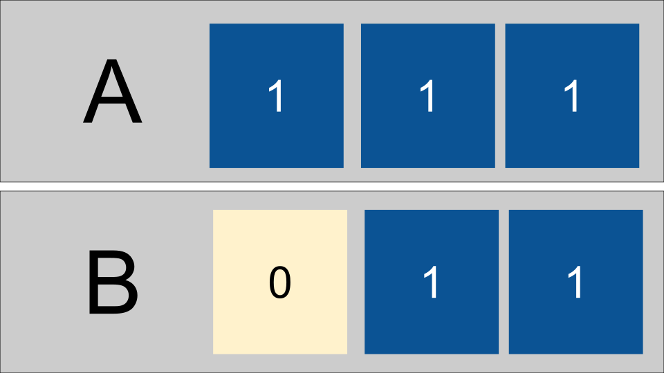

# How can we use logical operations?

## Why do we need to think about bitwise operations?  


Understanding them is prereq to what we will see today and that will help you understand hardware overall.  


You of course will not *need* every single thing we teach you in every single class.  


* Seeing topics once at least is the only way you can make an informed decision to study a topic deeper or not.
* Seeing a topic in more detail than you will use all the time actually helps you build intuition, or deep understanding, of the topic overall, and help you remember what you need to remember


## Bitwise operators review


- & : and
- | : or
- ^ : xor
- ~ : not
- >>: shift right
- <<: shift left


Let's review truth tables for and, or, and xor.


```{list-table} AND
:header-rows: 1
:name: truth-and


* - a
  - b
  - AND (a&b)
* - 0
  - 0
  - 0
* - 0
  - 1
  - 0
* - 1
  - 0
  - 0
* - 1
  - 1
  - 1
```


```{list-table} OR
:header-rows: 1
:name: truth-or


* - a
  - b
  - OR (a|b)
* - 0
  - 0
  - 0
* - 0
  - 1
  - 1
* - 1
  - 0
  - 1
* - 1
  - 1
  - 1
```


```{list-table} XOR
:header-rows: 1
:name: truth-xor


* - a
  - b
  - XOR (a^b)
* - 0
  - 0
  - 0
* - 0
  - 1
  - 1
* - 1
  - 0
  - 1
* - 1
  - 1
  - 0
```


In order to implement more complex calculations, using gates, we can use these tables as building blocks compared to the required output.  


There are more gate operations; you can see a simulation for [16 gates](https://lodev.org/logicemu/#id=gates16)


## Adding as an Algorithm


Let's review adding binary numbers. 

**remember, binary is a place-based system like the decimal placed based system you are likely familiar with**


How do you add each of the following: 
- 2 + 3
- 14 + 17
- 65 +37 


To add two or more digit numbers we add the right most place (ones) and if its' more than 10, we carry the 1 then add 3 numbers (1 and the other two digits). And proceed accordingly moving from right to left. 

Since binary is place-based adding with binary follows the same basic algorithm 

- add the two bits in the ones place
- carry to the next place if >=2


$$ 101 + 100 = 1001 $$


We first add the ones place and get a 1, then the two's place and get a zero then the 4's place and get 0 with a carried one.  


$$ 010 + 011 = 101 $$


In this case in the ones place we add 0 + 1 to get one, the two ones add to 0 with carry then 1 + 0 + 0 gives another 1.  


## Adding as logic gates


let's make a truth table for adding two bits.


```{list-table} Add
:header-rows: 1
:name: truth-add
* - a
  - b
  - out 2's
  - out 1's
* - 0
  - 0
  - 0
  - 0
* - 0
  - 1
  - 0
  - 1
* - 1
  - 0
  - 0
  - 1
* - 1
  - 1
  - 1
  - 0
```


Now, what gate can we use to get the output 1's place bit and what gate can we use to get the output 2's place bit by comparing to the truth tables above.


It turns out the one's place is an xor gate, and the two's place is an and gate.  


This makes up the [half adder, try one out at this simulator](https://lodev.org/logicemu/#id=half_adder).


## Implementing the carry

So this lets us as two bits, but what about adding a number with more bits?  


We can put multiple together, but there's one more wrinkle: the carry.  


That's what makes a [full adder](https://lodev.org/logicemu/#id=full_adder) different.  It adds three single bits, or a carry and two bits and outputs the result as a sum bit and a carry bit.  


## Adding more bits


Then we can link many of those together to get an [8 bit ripple adder](https://lodev.org/logicemu/#id=ripple_carry_adder).  


Alternatively, we can "lookahead" with the carry bit, passing it forward multiple places all at once, as shown in this [4 bit carry lookahead adder](https://lodev.org/logicemu/#id=cla_adder).


## Why do this? 

Workign through this example also reinforces not only the facts of how the binary works so that you can understand *how* a computer works.  Working with these abstractions to break down higher level operations into components like this (addition is a more complex operation than `and` or `xor`) help you see how this can be done.  

Sometimes you have low level problems like resource constraints and bitwise operations can be useful.  

We may not do this all the time, but when we need it, we need it. 

for example, consdier how to swap two values.  

Assume we have two variables `a` and `b` intitialized like: 
```{code-cell} python
a = 4
b=3
a,b
```

We could swap them like 
```{code-cell} python
tmp = a
a = b
b=a
```

then we can see the values to see that they are swapped

```{code-cell} python
a,b
```

Let's reset them

```{code-cell} python
a =4
b=3
a,b
```

With bitwise operations we can swap them without a 3rd variable. 

```{code-cell} python
a = a^b
b= a^b
a=a^b
```


then we can see the values to see that they are swapped

```{code-cell} python
a,b
```

If we implement this with only 3 bits we have a 1,2,4 places. 


Then we xor each bit and sotre the result in the first register (our a variable)



and next we xor again and store in b 


now the 4 has moved form A to B. If we xor one more time and store that in A,


## Prepare for Next Class

```{include} ../_prepare/2023-11-21.md
```

## Review today's class

```{include} ../_review/2023-11-16.md
```


## More Practice

```{include} ../_practice/2023-11-16.md
```


## Experience Report Evidence

Nothing separate

## Questions After Today's Class 

### How often will we be using the emulator moving foward?

We will use the logic emulator a few more times. 

### What other bitwise operations are there that do more efficient things like swap the values of two variables?

This is a good expore badge idea

### How much of a disadvantage (*performace wise*) is using the gates that are changed to fit economies of scale vs the simplifies versions?


Calculating this out is a good way to extend the practice badge today into an explore badge. 

Consider the time to pass through each gate as constant, but compare how the number of total gates changes. 

### Could you do any mathematical operation with bitwise operations like square root, cubed root, division, etc?

We can break anything down into bitwise operations.  Some are more complicated than others, but all the computer has is bitwise operations, so everything can be done with those. 


### How would we implement this in code?

This is how the computer implements your code as electrical activity. 

If the question is only about the XOR swap algorithm, I put real python code in the notes. 

### Are the curcuits and gates the things inside a processor?

Yes the processor contains circuits made up of gates. 


### Is it common to use tricks like the one above in embedded systems?

Yes

### Why is this so confusing and how can I understand how to do these operations better? 

More practice and maybe office hours? 

It is confusing because it is new. 

## Will this be extremely useful if we started working with computers at its very foundation? (Physics, Discrete Math etc.)


Yes! That is the type of cases where bitwise operations are the level that you reason at. 