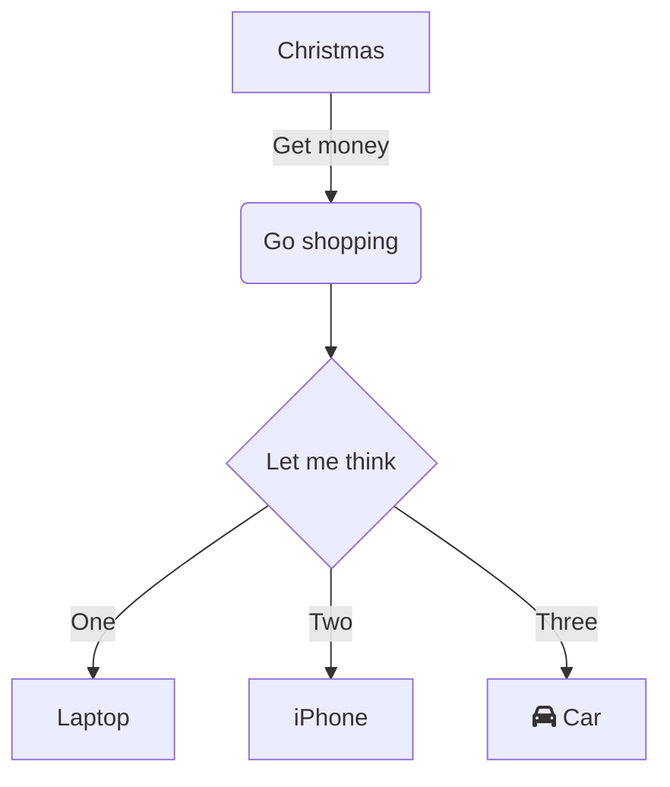

# Mermaid Overview

## What is Mermaid?

Mermaid is a flowchart and diagram visualization tool based on JavaScript and uses Markdown syntax to create flowcharts that are extremely dynamic and high quality. Mermaid is especially useful because you are able to display your beautiful flowcharts using backticks to create a code block. 

## Tutorial for Using Mermaid

Either on the [Mermaid](https://mermaid.live/edit#pako:eNpVjstqw0AMRX9FaNVC_ANeFBq7zSbQQrPzZCFsOTMk80CWCcH2v3ccb1qtxD3nCk3Yxo6xxP4W760lUTjVJkCe96ay4gb1NJyhKN7mAyv4GPgxw_7lEGGwMSUXLq-bv18lqKbjqjGodeG6bKh69r8Cz1A3R0oa0_kvOd3jDB-N-7b5_H9ihXPrs-mp7KloSaAieSq4Q8_iyXX5_WlNDKplzwbLvHYkV4MmLNmjUePPI7RYqoy8wzF1pFw7ugj5LVx-AfLqVWg) website or in the file you're making edits to you can make complex flowcharts seamlessly. 

### Using Code Blocks

A code block should look like the following:
````
```mermaid
blah blah blah
```
````

### Example Mermaid Code Block



In Mermaid there are different styles for boxes with either square or round edges and the option to give a description of each item in its pipe.

So the code above actually looks like this in it's code block:

````

````

There's lots of cool and unique things that can be created using Mermaid and the best way to understand it better is to continue to practice. 
